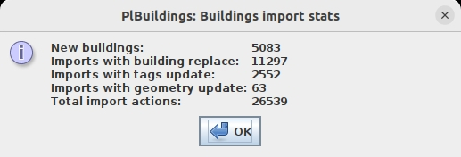
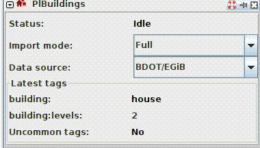
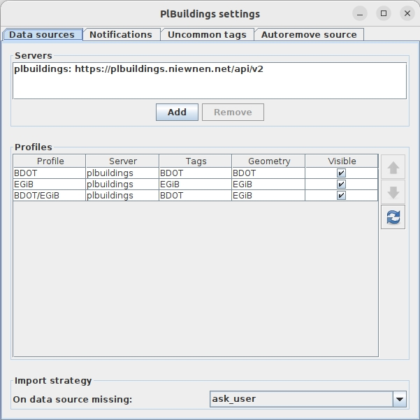
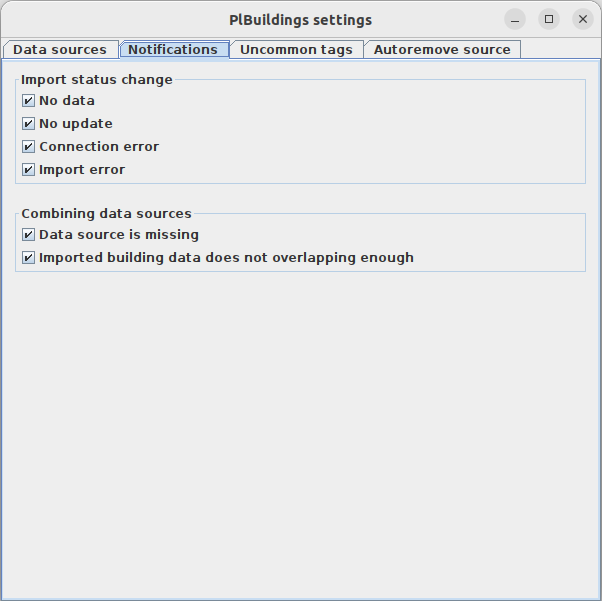
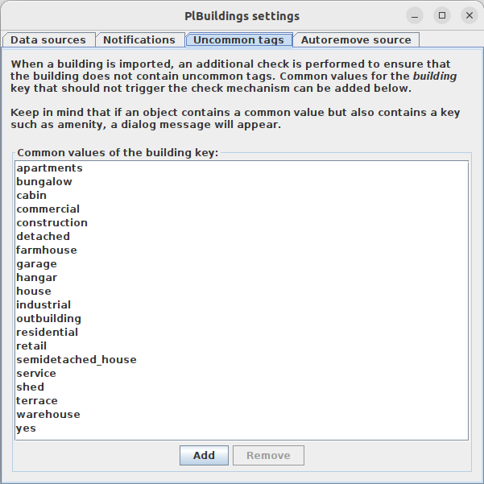

# PLBuildings plugin
[Czytaj po polsku](README.md).

## Description
PLBuildings is a [JOSM](https://josm.openstreetmap.de/) plugin
easily allows users to import buildings from Polish public datasets to add it to the OpenStreetMap.
It communicates with the [PLBuildings server](https://github.com/praszuk/josm-plbuildings-server) that obtains this data.

## Features
- Easy import of building at cursor position.
- Replacing geometry if old building is selected.
- Updating tags with the possibility of skipping most common replacement conflicts like from `building=yes` to `building=house` without showing the conflict tag dialog.
- Merging a building with an existing building. Adjacent nodes will be shared between the two buildings, meaning no overlapping or duplicated nodes.
- Avoiding duplicated imports.
- Simple statistics (counting imported/replaced buildings).
- Multilingual with i18n (English and Polish).
- Pre-checking buildings before replacing:
  - Looking for "survey" value.
  - Preventing tags simplification (e.g. `detached` -/> `house`)
  - Avoiding breaking `building:levels` if selected budilings has `roof:levels` tag.
- Post-checking imported building (looking for uncommon tags).
- Statuses (current state of import action).
- Import modes:
  - Full – default (full import of new building or full replace)
  - Geometry – geometry only update of selected building
  - Tags – tags only update of selected building
- Settings:
  - Multiple servers configurations
  - Multiple data sources including combined data sources (1st for geometry, 2nd for tags) – it also contains resolver if one source is missing
  - Notifications
  - Uncommon tags
  - ...more settings in JOSM advanced preferences with searching by key `plbuildings.`
- GUI Sidebar (Toggle Dialog) with:
  - Current status (of import operation)
  - Import mode
  - Data source
  - Latest tags (with Uncommon tags indicator)
- Auto-inject `source:building` and `source:geometry` tags
- Autoremove `source=geoportal.gov.pl` or `source=bing` tags

## How to use it
1. Install plugin in JOSM (same as other plugins via JOSM plugin settings).
2. Open ToggleDialog: On the left sidebar should be visible icon with houses (logo of this plugin) – click it. On the right side should appear toggle dialog same as below on the GIF.
3. Select Import mode and Data source – it will be remembered, but I recommend to keep dialog always open at importing to easily switching and keep looking on latest import.
4. Move the mouse cursor on a visible building and press `CTRL + SHIFT + 1` – it will trigger building import. If you select other building before pressing shortcut combination, then it will use _Replace Geometry_ feature (from [utilsplugin2](https://wiki.openstreetmap.org/wiki/JOSM/Plugins/utilsplugin2))
   to replace old shape and tags with the new one. It can show the tag conflict dialog window.

Note: If shortcut doesn't work (it may happen) or you want to just change it, go to the JOSM Keyboard Shortcut Settings and type `plbuildings`,
then change it for `Download building`.

**Important! Every import should be verified!** There is no such thing as perfect data, so occasional minor errors may occur, such as in the building type or the number of levels. Additionally, a building might serve a different [functional purpose](https://wiki.openstreetmap.org/wiki/Key:building:use).

Simple building import:

Import with replacing old building geometry:

To show statistics, go to:`Menu->Data->Buildings import stats`

Example stats:

Toggle dialog (GUI Sidebar) with a status changing at import:

Plugin settings `Menu->Data->PlBuildings: Settings`:

## License
[GPLv3](LICENSE)