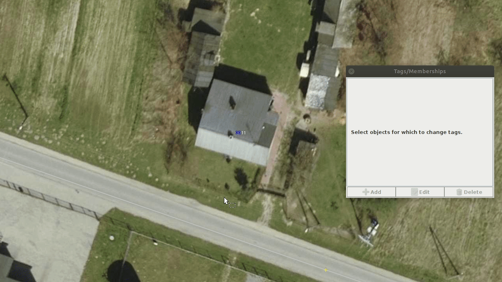
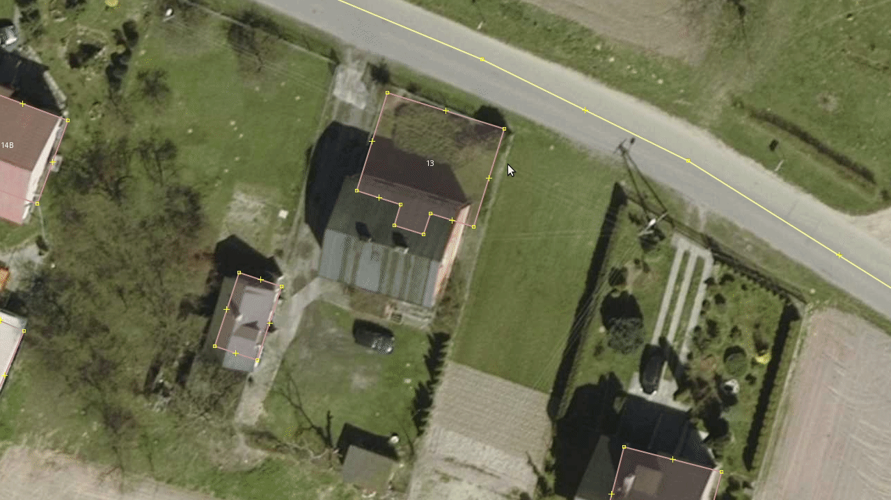
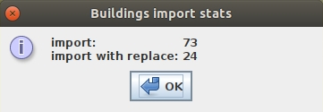
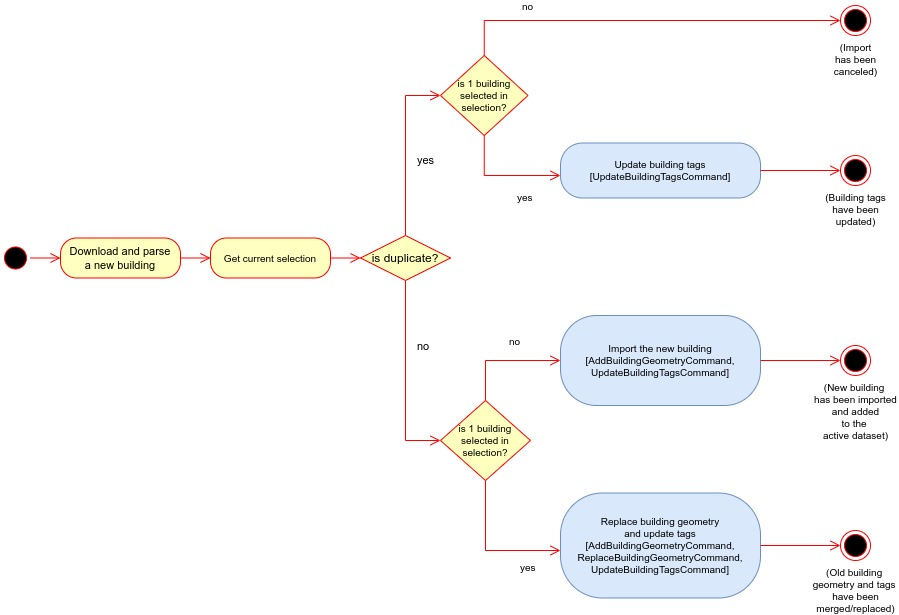

# PLBuildings plugin

## Description
PLBuildings is a [JOSM](https://josm.openstreetmap.de/) plugin 
which allows to easily import buildings from Polish public datasets to add it to the OpenStreetMap.
It communicates with the [PLBuildings server](https://github.com/praszuk/josm-plbuildings-server) that obtains this data.

## Features
- Easy import of building at cursor position.
- Replacing geometry if old building is selected.
- Updating tags with the possibility of skipping most common replacement conflicts like from `building=yes` to `building=house` without conflict tag dialog.
- Joining building other existing buildings. Adjacent nodes will be shared between 2 buildings. It means no overlapping duplicated nodes.
- Avoiding duplicated imports.
- Simple statistics (counting imported buildings).
- Multilingual with i18n (English and Polish).

## How to use it
Move the cursor to a building and press `CTRL + SHIFT + 1`.
If you select other building before pressing shortcut combination, then it will use _Replace Geometry_ feature (from [utilsplugin2](https://wiki.openstreetmap.org/wiki/JOSM/Plugins/utilsplugin2))
to replace old shape and tags with the new one. It can show the conflict window.

Simple building import:

Import with replacing old building geometry:

To show statistics, go to:`Menu->Data->Buildings import stats`

Example stats:

### Simplified buildings import action flow

## License
[GPLv3](LICENSE)