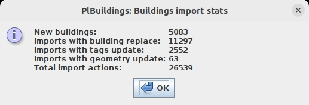
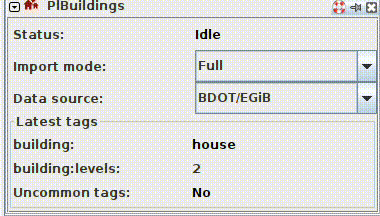
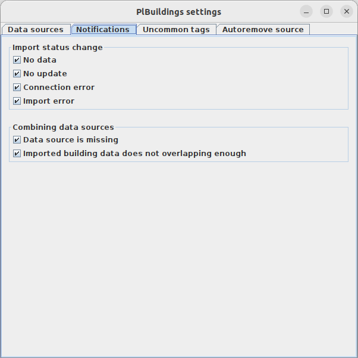

# PLBuildings plugin
[Read in English](README.en.md).

## Opis
PLBuildings to wtyczka do [JOSMa](https://josm.openstreetmap.de/), która umożliwia użytkownikom łatwe importowanie budyków z publicznych polskich zbiorów danych w celu dodania ich do OpenStreetMap.

Wtyczka komunikuje się z [serwerem PLBuildings](https://github.com/praszuk/josm-plbuildings-server) w celu pozyskiwania danych.

## Funkcjonalności
- Prosty import budynku w miejscu kursora myszy.
- Zastępowanie geometrii jeśli stary budynek jest zaznaczony.
- Aktualizacja tagów z możliwością pominięcia konfliktów _częstych tagów_ np. takich jak z `building=yes` na `building=house` bez wyświetlania okna dialogowego z konfliktem tagów.
- Łączenie budynku z istniejącym budynkiem. Sąsiadujące węzły będą współdzielone między budynkami – zapobiega to nakładającym/duplikującym się węzłom.
- Zapobieganie zduplikowanych importów.
- Proste statystyki (zliczanie zaimportowanych/podmienionych budynków).
- Wielojęzyczność z użyciem i18n (polski i angielski).
- Wstępne sprawdzanie budynków przed zastąpieniem:
    - Szukanie wartości "survey".
    - Zapobieganie zubożeniu tagów (np. `detached` -/> `house`)
    - Unikanie błędów związanych z `building:levels` w zależności od tego, czy zaznaczony budynek ma tag `roof:levels`.
- Sprawdzanie zaimportowanych budynków pod względem nietypowych tagów.
- Statusy (aktualny stan akcji importu).
- Tryby importu:
    - Pełny – domyślny (pełny import nowego budynku lub pełna zamiana)
    - Geometria – aktualizacja tylko geometrii dla zaznaczonego budynku
    - Tagi – aktualizacja tylko tagów dla zaznaczonego budynku
- Ustawienia:
    - Konfiguracje wielu serwerów
    - Wiele źródeł danych, w tym złączone źródła danych (np. 1 dla geometrii, 2 dla tagów) – zawiera to również mechanizm, który obsługuje braki w wybranym źródle.
    - Powiadomienia
    - Nietypowe tagi
    - ...więcej ustawień można znaleźć w ustawieniach zaawansowanych JOSMa, szukając po kluczu `plbuildings.`
- Boczny panel GUI (tzw. Toggle Dialog), który zawiera:
    - Aktualny status
    - Tryb importu
    - Źródło danych
    - Ostatnie tagi (wraz ze wskaźnikiem nietypowych tagów)
- Automatyczne dodawanie tagów `source:building` i `source:geometry`.
- Automatyczne usuwanie tagów `source=geoportal.gov.pl` i `source=bing`.

## Jak z niej korzystać
1. Zainstaluj wtyczkę w JOSMie (tak jak każdą inną – przez ustawienia JOSMa).
2. Otwórz boczny panel (Toggle Dialog): Po lewej stronie powinna być widoczna ikonka z budynkami (logiem tej wtyczki) – klknij na nią. Po prawej stronie powinien otworzyć się boczny panel wtyczki taki jak na GIFie poniżej.
3. Wybierz tryb importu i źródło danych – zostanie to zapamiętane, ale rekomenduję aby zawsze mieć otwarty ten boczny panel dla łatwiejszej zmiany trybu/źródła i aby mieć na uwadze ostatni import.
4. Nakieruj kursor myszy na widoczny budynek i naciśnij `CTRL + SHIFT + 1`.
5. Jeśli przed wciśnięciem skrótu został zaznaczony inny budynek, zostanie użyta funkcja zamiany geometrii z pluginu [utilsplugin2](https://wiki.openstreetmap.org/wiki/JOSM/Plugins/utilsplugin2) w celu aktualizacji starego kształtu. Może to wyświetlić okno dialogowe konfliktów tagów.

Notka: Jeśli skrót nie działa (może się tak zdarzyć) lub po prostu chcesz go zmienić na inny, wejdź w ustawienia skrótów w JOSMie i wpisz: `plbuildings`, następnie zmień skrót dla `Pobierz budynek`.

**UWAGA! Każdy import powinien zostać zweryfikowany!** Nie ma danych idealnych, stąd mogą się czasem pojawić drobne błędy związane np. z typem budynku lub liczbą pięter, ale również z budynkiem pełniącym inną [funkcję użytkową](https://wiki.openstreetmap.org/wiki/Pl:Key:building:use).

Prosty import budynku:

Import z zamianą starej geometrii budynku:

W celu wyświetlenia statystyk, otwórz: `Menu->Dane->Statystyki importowania budynków`

Przykładowe statystyki:

Boczny panel ze statusem zmieniającym się podczas importu:

Ustawienia wtyczki `Menu->Dane->PlBuildings: Ustawienia`:

## Licencja
[GPLv3](LICENSE)